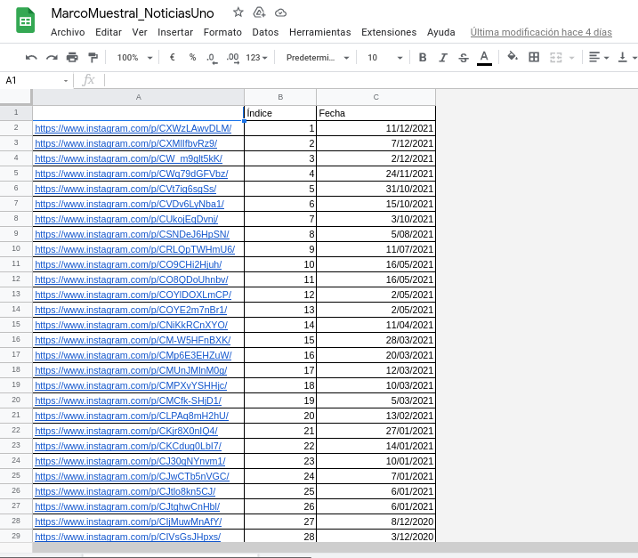
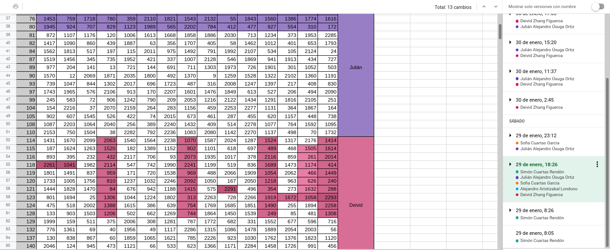
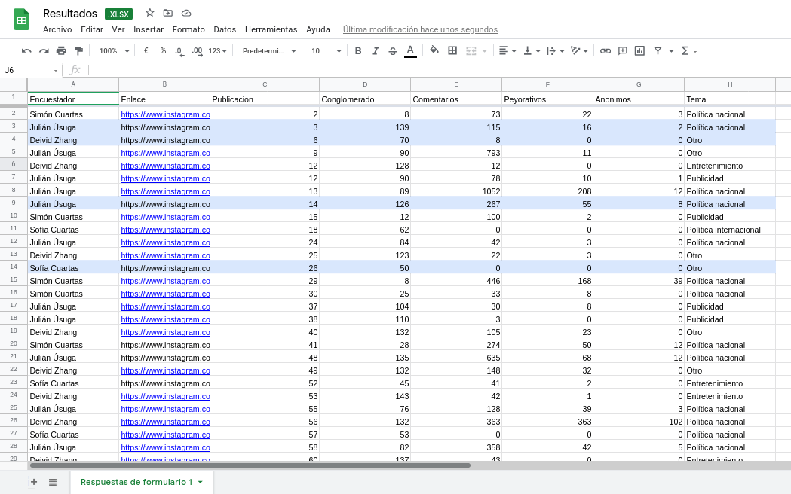

```{r setup, include=FALSE}
knitr::opts_chunk$set(echo = FALSE)
```

```{r, warning = FALSE, include = FALSE}
library(tidyverse)
library(gridExtra)
library(knitr)
library(readxl)
library(ggplot2)
library(dplyr)
```

# Motivación y contexto

Durante la última década se ha visto un aumento vertiginoso en la cantidad de usuarios que tienen cuentas en las diferentes redes sociales disponibles en el mercado, permitiendo a las personas interactuar de nuevas maneras mediante estos espacios virtuales, en los cuales les resulta posible compartir momentos de sus vidas mediante fotografías o videos, así como encontrarse con otros usuarios para discutir puntos de vista sobre algún tema y compartir noticias o contenidos de su interés.

No obstante, uno de los grandes problemas asociados a las redes sociales es la proliferación de agresiones y contenido de odio desde las más diversas fuentes, como lo pueden ser las noticias falsas, interacciones con usuarios con ideologías diferentes y comentarios a influencers (personas destacadas en las redes sociales) que no son de su agrado, entre otras.

Es por ello que nos motivamos a estudiar la cantidad total de comentarios con adjetivos peyorativos, emojis o cualquier otra representación o símbolo que evidencien de forma explícita la intención de agredir a una persona, grupo de personas, empresa, región geográfica o institución pública o privada, entre otras, que ocurren en la sección de comentarios de las publicaciones de Instagram del medio de comunicación Noticias Uno de Colombia. Pero además, se va a estudiar el promedio de comentarios peyorativos por publicación. Adicionalmente, se va a estimar la proporción de comentarios agresivos con el objetivo de mejorar las estimaciones (que son aquellas que carecen de un nombre real o una foto con una persona en ella).

# Parámetros a estimar

-   **Total** de comentarios peyorativos en la sección de comentarios de las publicaciones de Instagram del medio de comunicación Noticias Uno de Colombia.
-   **Promedio** de comentarios que se consideran negativos en la sección de comentarios de las publicaciones de Instagram del medio de comunicación Noticias Uno de Colombia.

# Aspectos importantes

-   **Elemento.** Se considera como elemento a cada uno de los comentarios en las publicaciones de Instagram realizadas por el medio de comunicación radial Noticias Uno de Colombia.

-   **Población.** La población está dada por la totalidad de comentarios realizados en las publicaciones de Instagram realizadas por el medio de comunicación radial Noticias Uno de Colombia.

-   **Unidad de muestreo.** Para lograr la estimación de los parámetros de interés, se realizará el estudio considerando como unidad de muestreo a cada uno de los comentarios de las publicaciones de Instagram realizadas por el medio de comunicación radial Noticias Uno de Colombia, que con corte a las 4:00 p.m. del viernes 10 de diciembre de 2021 totalizaron 2,290 publicaciones. Se debe tener en cuenta, además, que para poder listar todas estas publicaciones se usó XXXX, el cual es una extensión de Chrome que se encarga de enlistar de forma automática todas las publicaciones de cualquier página de Instagram junto su enlace y la fecha de publicación de cada publicación, además de asignarle un número, el cual usamos como denominación para una de las publicaciones. Luego, para cada publicación, se tiene que esta exhibe de forma pública el número de comentarios que hay en esta y luego se los enlista en orden de aparición.

-   **Tipo de muestreo.** Para abordar este trabajo se va a emplear el **muestreo por conglomerados**, para lo cual se toman los índices o ID de cada uno de los elementos muestrales, esto es, las fotos publicadas en la página de Instagram de *Noticias Uno* y se les organiza aleatoriamente para proseguir con una agrupación en grupos de quince publicaciones para poder construir los conglomerados, que serán quince en total, y a continuación se seleccionan de forma aleatoria veinte conglomerados para poder proceder con el muestreo. Todo lo anterior se realiza con ayuda de $\color{blue}{\textsf{R}}$.

```{r, include = FALSE}
set.seed(20220126)
# Aleatorización
indices = seq(1, 2295)

aleatorio = sample(indices,
                   size = 2295,
                   replace = FALSE)


# Matriz
auxiliar = matrix(aleatorio, ncol = 15, byrow = T)

# Conglomerados
conglomerados = as.data.frame(auxiliar)
save(conglomerados, file = "Conglomerados.RData") # ¿Guardar como .csv?
```

## Levantamiento de la información.

Para poder realizar el levantamiento de la información usando muestreo por conglomerados se apeló a una herramienta llamada *DownAlbum*, que se encarga de enumerar cada una de las publicaciones de la página de *Instagram* de *Noticias Uno*, incluyendo el enlace que dirige a cada publicación, la fecha en la que fue subida a la red social y un índice, dándole el primer número a la publicación más reciente al momento de generar el listado, y el último a la primera publicación compartida por Noticias Uno en *Instagram* (la mas antigua). De esta forma, teniendo en cuenta que se consideraron todas las publicaciones que se hicieron hasta el sábado 11 de diciembre de 2021 a las 16:00 (4:00 p.m. GMT -5, es decir, hora de Bogotá), se tiene que el tamaño de la población, osea, el número total de publicaciones en Instagram de Noticias Uno hasta dicha fecha es de 2,290 y se procede con la construcción de los conglomerados como se explicó antes

Con lo anterior presente, se generan con $\color{blue}{\textsf{R}}$ cuarenta números aleatorios para determinar cuáles van a ser los conglomerados a censar para recoger la información necesaria, los cuales se observan en la siguiente tabla

```{r}
set.seed(1037670103)
num.congl = seq(1, 153)
muestra = sort(sample(num.congl,
       size = 20,
       replace = FALSE))
```

```{r}
cong.muestreo = conglomerados[which(indices %in% muestra),]
write.csv(cong.muestreo, file = './muestreo.csv')
```

Para su levantamiento, entonces, cada uno de los cuatro integrantes asumió la recogida de datos de cinco conglomerados. Ahora bien, para el registro de los datos se creó un formulario de Microsoft Forums, el cual puede ser visto dando clic [aquí.](https://forms.office.com/Pages/ResponsePage.aspx?id=DQSIkWdsW0yxEjajBLZtrQAAAAAAAAAAAANAATOOFRZUMTU3SUY3SDgzVkdCU01OMVJMRFZKUlI4Vi4u) A continuación se muestran y se justifican cada uno de los elementos de este formulario.

-   **Encuestador.** Registra cuál es la persona que está llenando la información.
-   **Enlace.** Dirección web de la publicación.
-   **ID.** Número de la publicación en el marco muestral.
-   **Conglomerado.** ID del conglomerado asociado a la publicación censada.
-   **Fecha de publicación.** Fecha en la que fue subida la publicación a Instagram.
-   **Número de comentarios.** Cantidad total de comentarios.
-   **Número de comentarios con mensajes peyorativos.** Cantidad de comentarios en la publicación que tenían mensajes peyorativos, agresivos o violentos, entre otros.
-   **Tema.** Temática con la que se asocia la publicación. Para esta pregunta existen cuatro posibilidades:
-   Política nacional.
-   Deportes.
-   Entretenimiento.
-   Otros.

Y una vez recogidos los datos para las cuarenta publicaciones asignadas aleatoriamente por R, se genera automáticamente un cuadro en Excel con las respuestas, que puede ser visualizado haciendo clic [aquí](https://docs.google.com/spreadsheets/d/1KbT9Zq7wox5J-FuIwY8pn1o6kalcjQJ0/edit?usp=sharing&ouid=105931996792244454347&rtpof=true&sd=true).

```{r}
datos <- read.csv("Datos.csv", encoding = "UTF-8")
datos = na.omit(datos)
```

```{r}
datos = datos %>% 
  mutate(Fecha = as.Date(Fecha, format = "%d/%m/%Y")) %>% 
  rename(Encuestador = X.U.FEFF.Encuestador)
```

### Evidencia fotográfica









## Estudio piloto

`Bla, bla, bla`

Como se manifestó previamente, en este estudio se están considerando $N = `r nrow(conglomerados)`$, cada uno de $M = `r ncol(conglomerados)`$ unidades básicas. Así, se tiene que el número de unidades elementales en la población, es decir, el número publicaciones total a considerar es $M_0 = NM = `r nrow(conglomerados)*ncol(conglomerados)`$, que como se nota, son cinco unidades elementales más de las que realmente fueron consideras, esto porque se aleatorizaron los conglomerados con cinco unidades elementales imaginarias extras para poder asegurar que todos tuvieran tamaño uno. Ahora bien, para este estudio piloto se están considerando $n = 20$ conglomerados diferentes, seleccionados de manera aleatoria con ayuda de $\textsf{R}$, obteniendo que los que deben ser considerados son los siguientes:

`Insertar lista de conglomerados a estudiar (db conglomerados)`

Con esto, se va a considerar a $\mu_c$ como la media de comentarios peyorativos por conglomerados, $\mu$ la media de comentarios peyorativos en toda la población, es decir, en todas las publicaciones de *Noticias Uno* consideradas hasta la fecha de corte y $\tau$ el total. Además, sea $y_{ij}$ el número de comentarios peyorativos registrados en la *i-ésimo* publicación del *j-ésimo* conglomerado. Se sabe que los parámetros anteriores pueden ser calculados como sigue:

```{=tex}
\begin{gather*}
\tau = \sum_{i=1}^{N} \tau_i = \sum_{i} \sum_{j} y_{ij} \\
\mu_c = \frac{\tau}{N} \\
\mu = \frac{\tau}{NM} = \frac{\tau}{M_0}
\end{gather*}
```
Así, vale la pena comenzar observando el resultado obtenido en cada uno de los conglomerados en la siguiente tabla:

```{r}
comen.c = datos %>% 
  group_by(as.factor(datos$Conglomerado)) %>% 
  summarise(Comentarios = sum(Comentarios)) %>% 
  rename(Conglomerado = `as.factor(datos$Conglomerado)`)
anon.c = datos %>% 
  group_by(as.factor(datos$Conglomerado)) %>% 
  summarise(Ofensivos = sum(Ofensivos)) %>% 
  rename(Conglomerado = `as.factor(datos$Conglomerado)`) %>% 
  rename(Anonimo = Ofensivos)
peyor.c = datos %>% 
  group_by(as.factor(datos$Conglomerado)) %>% 
  summarise(Peyorativos = sum(Peyorativos)) %>% 
  rename(Conglomerado = `as.factor(datos$Conglomerado)`)
```

```{r}
resumen = merge(comen.c, peyor.c, by = "Conglomerado")
resumen = merge(resumen, anon.c, by = "Conglomerado")
```

```{r}
kable(resumen, caption = "Resultados en los conglomerados del estudio piloto")
```

Definido lo anterior, se puede comenzar estimando la media poblacional por conglomerado $\mu_c$ mediante la media muestral por conglomerado $\hat{\mu}_c$, el cual, teniendo en cuenta que los conglomerados tienen igual tamaño, puede ser calculada como sigue:

$$\hat{\mu}_c = \frac{1}{n} \sum_{i=1}^{n} \tau_i = \bar{y}_c$$

Así que al emplear la información de la tabla uno, se tiene que la media muestral por conglomerado es:

```{r}
suma.pey.c = sum(resumen[, 3])
congs = nrow(resumen)
est.m.c = suma.pey.c / congs
```

$$\hat{\mu}_c = \frac{4 + 16 + \ \ldots \ + 7 + 10}{`r nrow(resumen)`} = \frac{`r suma.pey.c`}{`r nrow(resumen)`} = `r round(suma.pey.c/nrow(resumen), 4)`$$mo

Lo que quiere decir que en cada conglomerado hay un promedio de `r round(est.m.c, 2)` comentarios peyorativos. Y con esto se puede estimar la cantidad promedio de comentarios peyorativos por unidad elemental como sigue:

```{r}
M = 15
est.m = est.m.c/M
```

$$\hat{\mu} = \frac{\hat{\mu}_c}{M} = `r round(est.m, 4)`$$ Es decir, existe un promedio de `r round(est.m, 2)` comentarios peyorativos, agresivos o irrespetuosos en cada publicación de *Instagram* de *Noticias Uno*. Además, el total de comentarios peyorativos puede ser estimado como sigue:

```{r}
options(scipen=999)
N = 153
Mo = M * N
est.t.c = N * est.m.c
```

$$\hat{\tau}_c = N \hat{\mu}_c = `r Mo` \times `r round(est.m.c, 4)` \approx `r round(est.t.c, 4)`$$ De manera que se estima que se han dejado un total de `r round(est.t.c)` comentarios peyorativos en todas las publicaciones de *Instagram* de *Noticias Uno* que habían si subidas a la red social hasta el once de diciembre de 2021.

Ahora bien, con el objetivo de determinar cuál es el número de conglomerados que deben ser estudiados en el muestreo final, es necesario obtener la varianza estimada de los estimadores expuestos previamente, lo cual se consigue con las siguientes ecuaciones:

```{=tex}
\begin{gather*}
\widehat{Var} [\hat{\tau}_c] = \frac{N(N-n)}{N} \sum_{i = 1}^{n} \frac{(\tau_i - \hat{\mu}_c)^2}{n-1} \\
\widehat{Var} [\hat{\mu}] = \frac{1}{M_0^2} \widehat{Var} [\hat{\tau}_c]
\end{gather*}
```
```{r}
# Total
n.ep = 20
totales.cong = as.vector(resumen[, 3])
paso1 = (totales.cong - est.m.c)^2
paso2 = paso1 / (n.ep - 1)
est.var.tc = sum(paso2) * N * (N - n.ep) / n.ep

# Media
est.var.m = est.var.tc / (Mo^2)

```

Y al realizar los respectivos cálculos se tiene que los estimadores de dichas varianzas son:

```{=tex}
\begin{gather*}
\widehat{Var} [\hat{\tau}_c] = `r round(est.var.tc, 4)` \\\
\widehat{Var} [\hat{\mu}] = `r round(est.var.m, 4)`
\end{gather*}
```
Y con estos cálculos se tienen la mayoría de elementos necesarios para poder determinar el número de conglomerados que deben ser finalmente considerados.

### Tamaño de muestra para la media poblacional

Para calcular el número de conglomerados $n_{\mu}$ necesarios para estimar con la muestra a la media de comentarios peyorativos en todas las publicaciones es necesario emplear la siguiente ecuación:

$$n = \frac{n_0}{1 + \frac{n_0}{N}}, \ \ \ \ \ n_0 = \frac{Z_{\alpha/2}^2 S^2_{con}}{B_{\mu}^2 M^2}$$

Así, es necesario calcular el valor de $S^2_{con}$, el cual puede ser calculado como sigue:

$$S^2_{con} = \sum_{i = 1}^{n} \frac{(\tau_i - \hat{\mu}_c)^2}{n-1}$$

```{r}
alfa = 0.10
z = qnorm((alfa/2), mean  = 0, sd = 1, lower.tail = FALSE)
epsilon = 0.15
Bm = epsilon * est.m
```

Para el cual, al realizar los cálculos con $\textsf{R}$, se obtiene que $S^2_{con} = `r round(sum(paso2), 4)`$. Además, considerando que se va a emplear un nivel de confianza del 90 % ($\alpha = 0.10$) (con lo que $Z_{0.05/2} = `r round(z, 4)`$) y un límite en el error de la estimación relativo del 10%, es decir, $\epsilon = 0.15$, de manera que el límite en el error de estimación $B_{\mu}$ es: $B_{\mu} = 0.10 \times `r round(est.m, 4)` = `r round(Bm, 4)`$. Así, se tiene que el número de conglomerados a muestrear si estos fuesen infinitos es:

```{r}
n0.m = ((z^2) * sum(paso2))/((Bm * M))^2
```

```{r}
n.m = n0.m / (1 + n0.m/N)
```

De manera que, al realizar la corrección por población finita y realizar las cuentas, se tiene que el número de conglomerados a muestrear es $`r ceiling(n.m)`$

### Tamaño de muestra para el total

Para encontrar el tamaño de muestra necesario para estimar el total poblacional es necesario emplear la siguiente ecuación:

$$n = \frac{N S_{con}^2}{ND + S_{con}^2}, \ \ \ \ D = \frac{B_{\tau}^2}{Z_{\alpha/2}^2 N^2}$$

```{r}
Bt = epsilon * est.t.c
```

De manera que para poder emplear esta ecuación es necesario comenzar encontrando el límite en el error de estimación, que, considerando que este está dado por $B_{\tau} = \epsilon \times \hat{\tau}_c$, de manera que se obtiene que $B_{\tau} = `r round(Bt, 4)`$. Luego, realizando las cuentas indicadas por las dos ecuaciones anteriores se tiene que:

```{r}
D = (Bt / (z * N))^2
n.t = (N * sum(paso2))/(N*D + sum(paso2))
```

$$D = `r round(D, 4)`, \ \ \ \ n_{\tau} \approx `r round(n.t, 4)` $$

Y como se ve el resultado es el mismo que para el tamaño de la muestra de la media poblacional, es decir, que se deben muestrear un total de `r ceiling(n.t)` conglomerados.

## Tabla resumen de los datos obtenidos en la encuesta.

```{r base de datos}
data<-read_xlsx("Resultados.xlsx")
```

### Variable *comentarios*.

Esta variable contiene el números total de comentarios para cada publicación muestreada, unos estadísticos de resumen son los siguientes:

```{=tex}
\begin{table}[!htb]
\begin{tabular}{|cc|}
\hline
\multicolumn{2}{|c|}{Número de comentarios por publicación} \\ \hline
\multicolumn{1}{|c|}{Minimo}                    & 0         \\ \hline
\multicolumn{1}{|c|}{Primer Cuantil (Q1)}       & 1         \\ \hline
\multicolumn{1}{|c|}{Mediana}                   & 2         \\ \hline
\multicolumn{1}{|c|}{Tercer cuantil (Q3)}       & 12        \\ \hline
\multicolumn{1}{|c|}{Máximo}                    & 1052      \\ \hline
\multicolumn{1}{|c|}{Moda}                      & 0         \\ \hline
\end{tabular}
\end{table}
```
```{r echo = FALSE, warning=FALSE}
#summary(data[,5])
hist(as.vector(t(data[,5])), breaks= 25,main= "Histograma de comentarios",xlab="Número de comentarios por publicación",ylab="Frecuencia", col="red",xlim = c(0,1200))
```

vemos que el número de comentarios que más se repite es cero con una frecuencia de 301, además como se puede ver en el gráfico de barra el número de comentarios varía mucho, y es evidente que un número de comentarios más pequeño es lo más frecuente para una publicación.

### Variable *peyorativos*.

Esta variable contiene el número de comentarios peyorativos de cada publicación; a continuación una tabla con estadísticos de resumen y el respectivo diagrama de barras

```{=tex}
\begin{table}[htb]
\begin{tabular}{|cc|}
\hline
\multicolumn{2}{|c|}{Número de comentarios peyorativos por publicación} \\ \hline
\multicolumn{1}{|c|}{Minimo}                          & 0               \\ \hline
\multicolumn{1}{|c|}{Primer Cuantil (Q1)}             & 0               \\ \hline
\multicolumn{1}{|c|}{Mediana}                         & 0               \\ \hline
\multicolumn{1}{|c|}{Tercer cuantil (Q3)}             & 1               \\ \hline
\multicolumn{1}{|c|}{Máximo}                          & 363             \\ \hline
\multicolumn{1}{|c|}{Moda}                            & 0               \\ \hline
\end{tabular}
\end{table}
```
```{r}
#summary(data[,6])
hist(as.vector(t(data[,6])),breaks=30,main= "Histograma de comentarios peyorativos",xlab="Número de comentarios peyorativos por publicación",ylab="Frecuencia", col="blue",xlim=c(0,400))
```

Sabemos que el numero que mas se repite es cero con una frecuencia de 841, Nuevamente se observa que los valores que puede alcanzar esta variable varía bastante y que aún sigue siendo más frecuente un número más pequeño de comentarios peyorativos, lo que cambia esta vez es que la frecuencia de estos comentarios es mucho menos en comparación con la frecuencia de comentarios totales.

### Variable *anonimos*.

```{=tex}
\begin{table}[htb]
\begin{tabular}{|cc|}
\hline
\multicolumn{2}{|c|}{Número de comentarios anonimos por publicación} \\ \hline
\multicolumn{1}{|c|}{Minimo}                          & 0               \\ \hline
\multicolumn{1}{|c|}{Primer Cuantil (Q1)}             & 0               \\ \hline
\multicolumn{1}{|c|}{Mediana}                         & 0               \\ \hline
\multicolumn{1}{|c|}{Tercer cuantil (Q3)}             & 0               \\ \hline
\multicolumn{1}{|c|}{Máximo}                          & 102             \\ \hline
\multicolumn{1}{|c|}{Moda}                            & 0               \\ \hline
\end{tabular}
\end{table}
```
```{r}
#summary(data[,7])
hist(as.vector(t(data[,7])),breaks= 6,main= "Histograma de comentarios anónimos",xlab="Número de comentarios anónimos por publicación",ylab="Frecuencia", col="orange",xlim=c(0,120))

```

Es evidente que el número de comentarios para esta variable se reduce en gran medida, y por lo que nos muestra los estadísticos de resumen parece ser que no suele haber comentarios realizados por cuentas anónimas.

### Variable *Tema*.

```{r include = FALSE}
#pol
pol<-data[data[,8]=="Política nacional",]
peyorpol<-sum(pol$Peyorativos)
compol<-sum(pol$Comentarios)
#otro
otro<-data[data[,8]=="Otro",]
peyorotro<-sum(otro$Peyorativos)
comotro<-sum(otro$Comentarios)
#Entrete
ent<-data[data[,8]=="Entretenimiento",]
peyorent<-sum(ent$Peyorativos)
coment<-sum(ent$Comentarios)
#polint
polint<-data[data[,8]=="Política internacional",]
peyorpolint<-sum(polint$Peyorativos)
compolint<-sum(polint$Comentarios)
#Deporte
dep<-data[data[,8]=="Deportes",]
peyordep<-sum(dep$Peyorativos)
comdep<-sum(dep$Comentarios)
#pub
pub<-data[data[,8]=="Publicidad",]
peyorpub<-sum(pub$Peyorativos)
compub<-sum(pub$Comentarios)
```

```{r }
Tema_de_las_publicaciones<-c(rep("Política nacional",2),rep("Otro",2),rep("Publicidad",2),rep("Entretenimiento",2),rep("Política internacional",2),rep("Deportes",2))
Tipo_comentario<-rep(c("Comentarios totales","Comentarios Peyorativos"),6)
Número_de_comentarios<-c(compol,peyorpol,comotro,peyorotro,compub,peyorpub,coment,peyorent,compolint,peyorpolint,comdep,peyordep)
dat<-data.frame(Tema_de_las_publicaciones,Tipo_comentario,Número_de_comentarios)
ggplot(dat, aes(fill=Tipo_comentario, y=Número_de_comentarios, x=Tema_de_las_publicaciones)) + 
    geom_bar(position="dodge", stat="identity")+theme(axis.text.x = element_text(angle = 90,vjust = 0.5, hjust=0.5))+ggtitle("Gráfico para la Variable Tema")+theme(plot.title = element_text(hjust = 0.5))

```

En la anterior gráfica de barras se puede evidenciar que las publicaciones que están asociadas a política nacional son las que reciben más comentarios en general y comentarios peyorativos, le siguen las publicaciones relacionadas con otro tipo de temas, además resalta que las publicaciones relacionadas con deporte son las que menos comentarios reciben y parece ser que los comentarios peyorativos que contienen son mínimos.


## 9B

```{r}
datos = read_xlsx("Resultados.xlsx")
```

# Se halla los estimadores
Primeramente agrupamos por conglomerado y hallamos los parámetros de interés que son el total y la media.
```{r}
datos_1 <- datos %>% group_by(Conglomerado) %>% summarise(n=n(), ti = sum(Peyorativos), mui = sum(Peyorativos)/n())
```

La media estimada $\hat{\mu}_{c}$ de comentarios peyorativos por conglomerado está dado por:
```{r}
media_estimada_conglomerado_peyorativo = sum(datos_1$ti)/88
media_estimada_conglomerado_peyorativo
```
Es decir, en promedio hay 54 comentarios peyorativos en cada conglomerado.

Ahora, se halla la media estimada de comentarios peyorativos por publicación $\hat{\mu}$, la cual está dada por:
```{r}
media_estimada_peyorativo = media_estimada_conglomerado_peyorativo/15
media_estimada_peyorativo
```
Es decir, en promedio hay 4 comentarios peyorativos en cada publicación.

Para el total estimado de comentarios peyorativos para los 153 conglomerados está dado por:

$\hat{\tau}_{c} = 153*\hat{\mu}_{c} = 153*53.89773 = 8246.353$. Es decir, hay 8247 comentarios peyorativos en total.

Teniendo estos valores, se halla los intervalos de confianza al 95% para los parámetros de interés $\mu$ y $\tau$.

Primeramente, se halla la varianza estimada de $\hat{\tau}_c$ y $\hat{\mu}_c$, y con esta se hallará el error estándar estimado para estos estimadores:

```{r}
# Para tau estimado
N = 153
n = 88
s_con = sum((datos_1$ti - media_estimada_conglomerado_peyorativo)^2)/(n-1)
var_est_tau_c_est = N*(N-n)/n*s_con
error_estandar_tau_c_est = sqrt(var_est_tau_c_est)
error_estandar_tau_c_est # error estándar estimado
```

El error estándar estimado de $\hat{\tau}_c = 776.964$.

```{r}
# Para mu estimado
M_0 = 2290
var_est_mu_con_est = 1/M_0^2*var_est_tau_c_est
error_estandar_mu_est = sqrt(var_est_mu_con_est)
error_estandar_mu_est
```

El error estándar estimado de $\hat{\mu} = 0.3392856$.

```{r}
cuantil_t = qt(0.025,n-1,lower.tail = F)
# Intervalos de confianza para tau
intervalo_tau = c(8246.353 - cuantil_t*error_estandar_tau_c_est, 8246.353 + cuantil_t*error_estandar_tau_c_est)

cat("Intervalo de confianza al 95% para tau: ",intervalo_tau, end="\n")

# Intervalos de confianza para mu
intervalo_mu = c(media_estimada_peyorativo - cuantil_t*error_estandar_mu_est, media_estimada_peyorativo + cuantil_t*error_estandar_mu_est)
cat("Intervalo de confianza al 95% para mu: ",intervalo_mu)
```

Luego con un nivel de confianza de 95%, el número total $\tau$ de comentarios peyorativos que hay en las 2290 publicaciones se encuentra entre 6703 comentarios y 9791 comentarios, y la cantidad media $\mu$ de comentarios peyorativos por publicación se encuentra entre 3 comentarios y 5 comentarios.


Por último, se halla el B usando 88 conglomerados para comprobar si este mejoró.

Primeramente, reemplazando los respectivos valores de la fórmula:

$$n = \frac{n_0}{1 + \frac{n_0}{N}} = 88 = \frac{n_0}{1 + \frac{n_0}{153}} \Longrightarrow n_0 = \frac{13464}{65}$$
Luego, despejando la fórmula siguiente:

$$n_0 = \frac{z^2S_{con}^{2}}{B^2M^2}$$.

se tiene que,

$$B = \sqrt{\frac{z^2S_{con}^2}{n_0M^2}}$$
Reemplazando los valores obtenidos se tiene que,

$$B = \sqrt{\frac{1.96^2*5341.702}{\frac{13464}{65}*2290^2}}$$

Luego, B = 0.0043464, y como podemos evidenciar esta disminuyó, lo que quiere decir que nuestro I.C es más preciso.


